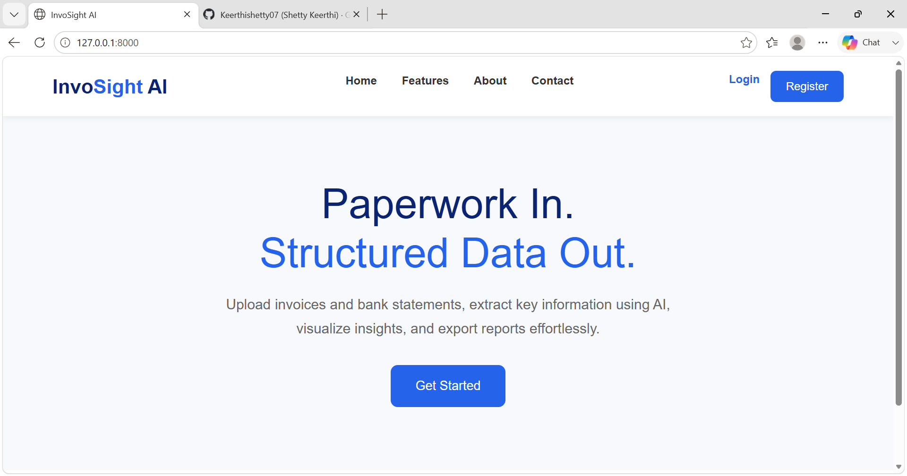
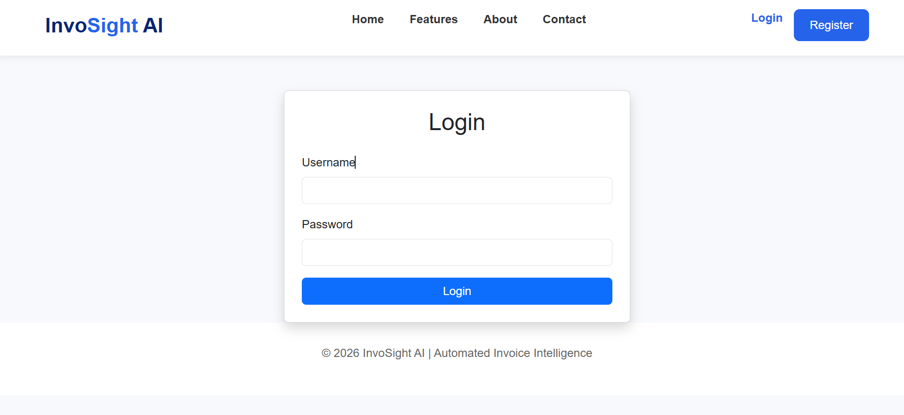
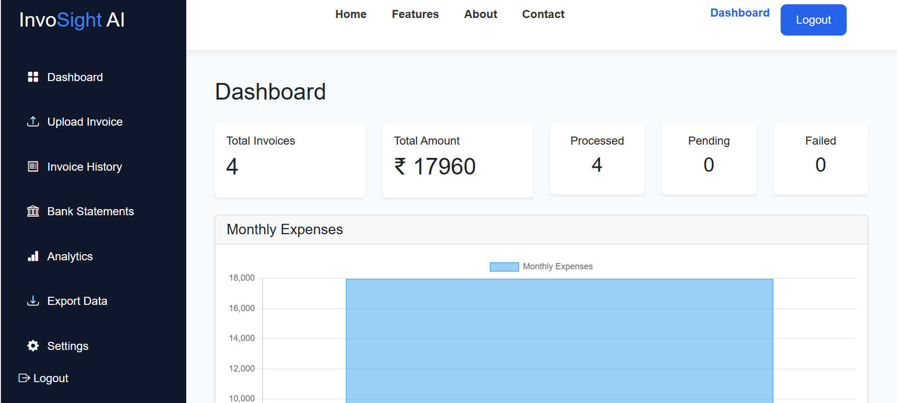
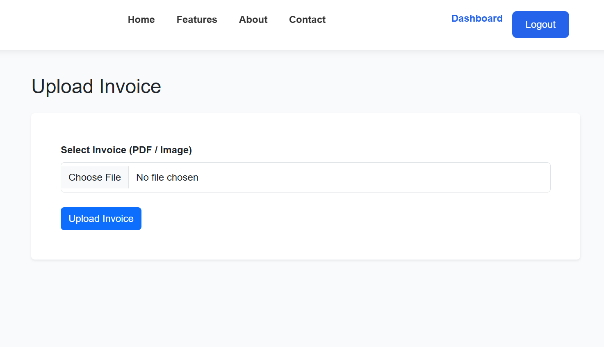
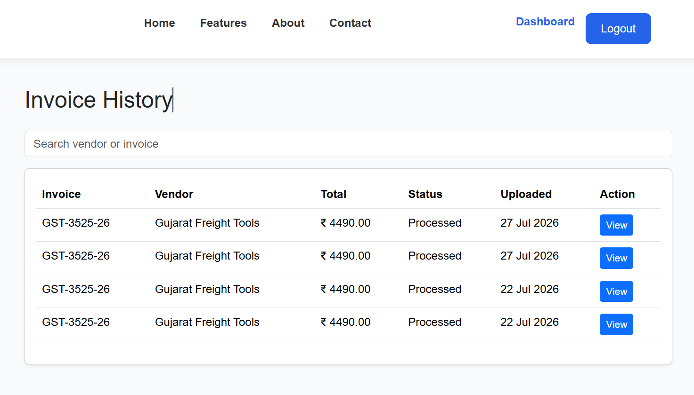
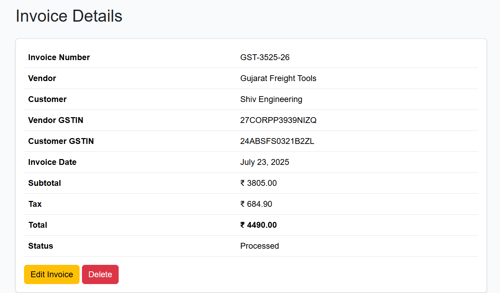

# 🚀 InvoSight AI

<p align="center">
  
  
  
  
  
</p>

---

# 📖 About the Project

**InvoSight AI** is an AI-powered Invoice Management System developed using **Django** and **OCR.space API**.

The application allows users to upload invoice images or PDF files, automatically extracts important invoice information using Optical Character Recognition (OCR), stores the extracted data securely, and provides an interactive dashboard to visualize financial insights.

The goal of this project is to simplify invoice processing by reducing manual data entry and providing quick access to invoice analytics.

---

# ✨ Features

## 👤 User Authentication

- 🔐 User Registration
- 🔑 Secure Login
- 🚪 Logout
- 👥 User-specific Dashboard

---

## 📄 Invoice Management

- 📤 Upload Invoice (Image/PDF)
- 🤖 AI-powered OCR Extraction
- 📝 Automatic Data Extraction
- 📅 Invoice Date Detection
- 🏢 Vendor Identification
- 🧾 Customer Identification
- 🏷 GSTIN Extraction
- 💰 Taxable Amount Detection
- 💵 Tax Calculation
- 💸 Total Amount Detection

---

## 📂 Invoice History

- 📋 View Uploaded Invoices
- 🔍 Search by Vendor
- 🔎 Search by Invoice Number
- ✏ Edit Invoice Details
- 🗑 Delete Invoice
- 👁 View Complete Invoice Information

---

## 📊 Analytics Dashboard

- 📄 Total Uploaded Invoices
- 💰 Total Invoice Amount
- ✅ Processed Invoices
- ⏳ Pending Invoices
- ❌ Failed Invoices
- 📈 Monthly Expense Bar Chart
- 🥧 Invoice Status Pie Chart
- 🕒 Recent Invoice Activity

---

## 🏦 Bank Statement Module

- 📤 Upload Bank Statements
- 🔄 Ready for AI-based Bank Statement Parsing

---

## 📥 Export

- 📄 Export Invoice Data to CSV

---

# 🧠 AI Features

✔ OCR using OCR.space API

✔ PDF Support

✔ Image Support

✔ Automatic Invoice Field Detection

✔ GST Number Recognition

✔ Invoice Number Recognition

✔ Vendor Extraction

✔ Customer Extraction

✔ Date Extraction

✔ Financial Amount Extraction

---

# 🛠 Tech Stack

## Backend

- Python
- Django
- SQLite

## Frontend

- HTML5
- CSS3
- Bootstrap 5
- JavaScript

## AI & OCR

- OCR.space API
- PyMuPDF (fitz)
- pdf2image
- Pillow
- Regular Expressions (Regex)

## Charts

- Chart.js

---

# 📁 Project Structure

```
InvoSightAI
│
├── accounts/
│
├── dashboard/
│
├── invoices/
│
├── bank_statements/
│
├── ai_engine/
│
├── templates/
│
├── static/
│
├── media/
│
├── requirements.txt
│
├── manage.py
│
└── README.md
```

---

# ⚙ Installation

## 1️⃣ Clone Repository

```bash
git clone https://github.com/Keerthishetty07/InvoSightAI.git
```

---

## 2️⃣ Move into Project

```bash
cd InvoSightAI
```

---

## 3️⃣ Install Dependencies

```bash
pip install -r requirements.txt
```

---

## 4️⃣ Apply Database Migrations

```bash
python manage.py migrate
```

---

## 5️⃣ Create Superuser (Optional)

```bash
python manage.py createsuperuser
```

---

## 6️⃣ Run Server

```bash
python manage.py runserver
```

---

## 7️⃣ Open Browser

```
http://127.0.0.1:8000/
```

---

# 📸 Application Screens

## 🏠 Home Page



## 🔐 Login Page



## 📊 Dashboard



## 📤 Upload Invoice



## 📄 Invoice History



## 🧾 Invoice Details



---

# 🔄 Project Workflow

```
User Login
      │
      ▼
Upload Invoice
      │
      ▼
OCR Processing
      │
      ▼
AI Data Extraction
      │
      ▼
Store in Database
      │
      ▼
Dashboard Analytics
      │
      ▼
Search / Edit / Export
```

---

# 📊 Dashboard Metrics

The Dashboard displays:

- 📄 Total Invoices
- 💰 Total Invoice Value
- 📈 Monthly Expenses
- 🥧 Invoice Status Distribution
- 🕒 Recently Uploaded Invoices

---

# 🔍 OCR Extraction

The OCR Engine automatically extracts:

- Invoice Number
- Invoice Date
- Vendor Name
- Customer Name
- Vendor GSTIN
- Customer GSTIN
- Taxable Amount
- GST Amount
- Total Amount

---

# 📦 Export Functionality

Users can export invoice records into CSV format for:

- Accounting
- Financial Analysis
- Backup
- Reports

---

# 🚀 Future Enhancements

- 🤖 AI Confidence Score
- 🏦 Complete Bank Statement Parser
- 📑 PDF Report Generation
- 📧 Email Notifications
- 🔔 Due Date Alerts
- ☁ Cloud Storage
- 📱 Mobile Responsive Dashboard
- 🌐 Multi-language OCR
- 🔍 Duplicate Invoice Detection
- 💹 Expense Prediction using Machine Learning

---

# 🎯 Learning Outcomes

This project demonstrates knowledge of:

- Django Development
- AI Integration
- OCR Technology
- Database Management
- Authentication
- File Upload Handling
- Data Visualization
- CRUD Operations
- Dashboard Design
- Financial Data Processing

---

# 👨‍💻 Developed By

### **Shetty Keerthi**

Data Science Student

📧 Email: keerthishetty580@gmail.com

🔗 GitHub: https://github.com/Keerthishetty07

---

# ⭐ If you like this project

Please consider giving it a ⭐ on GitHub!

---

## 🙏 Thank You

Thank you for visiting **InvoSight AI**.

Made with ❤️ using **Python**, **Django**, and **AI**.